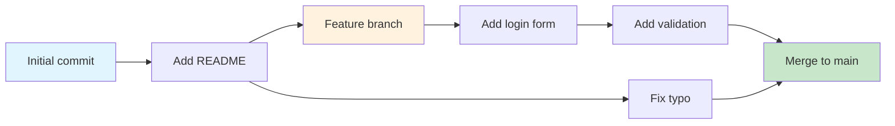
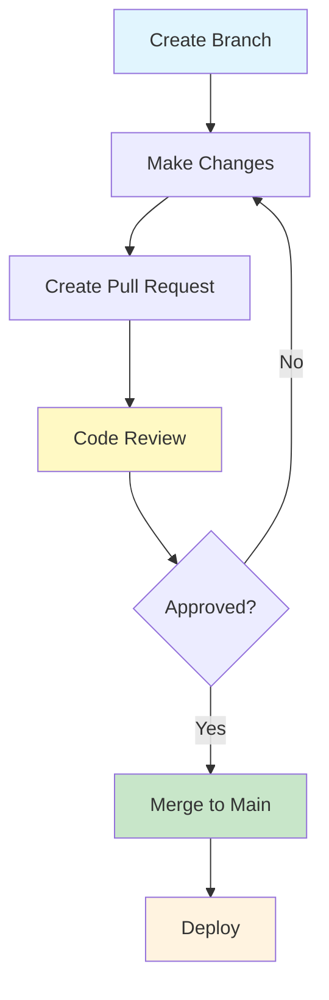

# Version Control with Git & GitHub
## Mastering Modern Development Workflows

  
    Press Space for next page <carbon:arrow-right class="inline"/>
  

  <button @click="$slidev.nav.openInEditor()" title="Open in Editor" class="text-xl slidev-icon-btn opacity-50 !border-none !hover:text-white">
    <carbon:edit />
  </button>
  <a href="https://github.com/ratulalahy/intro_to_swe" target="_blank" alt="GitHub" title="Open in GitHub"
    class="text-xl slidev-icon-btn opacity-50 !border-none !hover:text-white">
    <carbon-logo-github />
  </a>

---
layout: quote
---

# "Our civilization runs on software"
## - Bjarne Stroustrup

---
layout: center
class: text-center
---

# Learning Objectives 🎯

<h3>Understand</h3>

Version control fundamentals and why they matter

<h3>Master</h3>

Essential Git commands and workflows

<h3>Learn</h3>

GitHub collaboration and team practices

<h3>Practice</h3>

Professional branching and merging strategies

---
layout: center
background: https://images.unsplash.com/photo-1551288049-bebda4e38f71?w=1920&h=1080&fit=crop
---

# The Version Control Problem 🤯

<h3 class="text-red-600 font-bold mb-4">Before Version Control:</h3>
<ul class="text-lg space-y-2">
<li>📁 <code>project_final.zip</code></li>
<li>📁 <code>project_final_v2.zip</code></li>
<li>📁 <code>project_final_REALLY_final.zip</code></li>
<li>📁 <code>project_final_use_this_one.zip</code></li>
<li>📁 <code>project_final_FINAL_FINAL.zip</code></li>
</ul>

<h3 class="text-green-600 font-bold mb-4">With Git:</h3>
<ul class="text-lg space-y-2">
<li>📚 Complete history of all changes</li>
<li>👥 Multiple developers working simultaneously</li>
<li>🌿 Safe experimentation with branches</li>
<li>⏪ Easy rollback to any version</li>
<li>🔍 Detailed tracking of who changed what</li>
</ul>

---
layout: image-right
image: https://images.unsplash.com/photo-1556075798-4825dfaaf498?w=800&h=600&fit=crop
---

# Git vs GitHub 🆚

<h3 class="text-blue-800 font-bold">🖥️ Git - Local Version Control</h3>
<ul class="text-blue-700 mt-2">
<li>Runs on your computer</li>
<li>Tracks file changes</li>
<li>Works offline</li>
<li>Command-line tool</li>
</ul>

<h3 class="text-purple-800 font-bold">☁️ GitHub - Cloud Platform</h3>
<ul class="text-purple-700 mt-2">
<li>Remote repository hosting</li>
<li>Web-based interface</li>
<li>Collaboration features</li>
<li>Project management tools</li>
</ul>

---
layout: center
---

# Real-World Impact 🌍

🐧

<h3 class="font-bold text-xl mb-2">Linux Kernel</h3>

30+ million lines of code 65,000+ contributors

📱

<h3 class="font-bold text-xl mb-2">WhatsApp</h3>

100+ billion messages daily 2+ billion users ~1,000 employees

🚀

<h3 class="font-bold text-xl mb-2">Netflix</h3>

Deploys 1000+ times per day Thanks to Git workflows

All powered by Git & GitHub! 🔥

---
layout: center
---

# The Three Trees of Git 🌳

📝

<h3 class="font-bold text-xl mb-2">Working Directory</h3>

Your current project files

<ul class="text-xs mt-2 space-y-1">
<li>Modified files</li>
<li>New files</li>
<li>Deleted files</li>
</ul>

📦

<h3 class="font-bold text-xl mb-2">Staging Area</h3>

Prepared changes for commit

<ul class="text-xs mt-2 space-y-1">
<li>Files ready to commit</li>
<li>Snapshot of changes</li>
<li>Quality control</li>
</ul>

🏛️

<h3 class="font-bold text-xl mb-2">Repository</h3>

Permanent project history

<ul class="text-xs mt-2 space-y-1">
<li>All committed changes</li>
<li>Complete timeline</li>
<li>Branch information</li>
</ul>

---
layout: center
---

# Essential Git Commands 🔧

<h3 class="text-xl font-bold mb-4 text-blue-600">🏗️ Repository Setup</h3>

# Initialize repository

git init

# Clone existing repo

git clone &lt;url&gt;

<h3 class="text-xl font-bold mb-4 text-purple-600">📋 Basic Workflow</h3>

# Check status

git status

# Stage changes

git add .

# Commit changes

git commit -m "message"

<h3 class="text-xl font-bold mb-4 text-red-600">🌿 Branching</h3>

# Create branch

git checkout -b feature

# Switch branch

git checkout main

# Merge branch

git merge feature

<h3 class="text-xl font-bold mb-4 text-orange-600">☁️ Remote Operations</h3>

# Push to remote

git push origin main

# Pull from remote

git pull origin main

# Fetch updates

git fetch

---
layout: center
class: text-center
---

# Let's Code Together! 👨‍💻

<h2 class="text-3xl font-bold mb-4">Hands-On Exercise</h2>

Create your first Git repository step by step!

✅ Configure Git identity

✅ Initialize a repository

✅ Create and commit files

✅ Connect to GitHub

Open your terminal and follow along! 🚀

---
layout: two-cols
---

# Step 1: Git Configuration ⚙️

# Set your identity (do once per computer)

git config --global user.name "Your Name"

git config --global user.email "you@example.com"

# Verify configuration

git config --list

<h4 class="font-bold text-blue-800">💡 Pro Tip</h4>

Use the same email you'll use for GitHub to link your commits to your profile!

::right::

# Step 2: Create Repository 📁

# Create project directory

mkdir my-first-repo

cd my-first-repo

# Initialize Git

git init

# Check status

git status

<h4 class="font-bold text-green-800">✅ Expected Output</h4>

Initialized empty Git repository in /path/to/my-first-repo/.git/

---
layout: center
---

# Step 3: Your First Commit 🎉

# Create a README file

echo "# My First Repository" > README.md

echo "This is my introduction to Git!" >> README.md

# Check what changed

git status

# Stage the file

git add README.md

# Commit the changes

git commit -m "Initial commit: Add README"

📝

1. Create/Edit

📦

2. Stage

✅

3. Commit

---
layout: center
---

# Understanding Branches 🌿

Think of branches like tree branches 🌳

Separate development paths that can merge back together

---
layout: two-cols
---

# Creating Branches 🆕

# Create new branch

git branch feature/awesome-feature

# Switch to branch

git checkout feature/awesome-feature

# Create and switch (shortcut)

git checkout -b feature/another-feature

# List all branches

git branch

::right::

# Working with Branches ⚙️

# Make changes

echo "New feature!" > feature.txt

# Stage and commit

git add feature.txt

git commit -m "Add awesome feature"

# Switch back to main

git checkout main

# Merge feature branch

git merge feature/awesome-feature

---
layout: center
background: https://images.unsplash.com/photo-1556075798-4825dfaaf498?w=1920&h=1080&fit=crop
---

# GitHub: Collaboration Supercharged 🚀

<h3 class="text-2xl font-bold mb-4 text-blue-300">🐙 GitHub Features</h3>
<ul class="space-y-2 text-lg">
<li>☁️ Remote repository hosting</li>
<li>👥 Team collaboration tools</li>
<li>📋 Issue tracking</li>
<li>📊 Project management</li>
<li>🔄 Pull requests & code review</li>
<li>🤖 GitHub Actions (CI/CD)</li>
</ul>

<h3 class="text-2xl font-bold mb-4 text-green-300">🌟 Why GitHub?</h3>
<ul class="space-y-2 text-lg">
<li>🌍 65+ million developers</li>
<li>📚 200+ million repositories</li>
<li>🏢 Used by every major company</li>
<li>🚀 Powers open source</li>
<li>💼 Industry standard</li>
<li>🎓 Great for portfolios</li>
</ul>

---
layout: center
---

# The GitHub Flow 🔄

🌿

Branch

💻

Code

👀

Review

🚀

Deploy

---
layout: center
---

# Exercise: GitHub Repository 🏗️

<h2 class="text-2xl font-bold mb-6 text-center">Let's Create Your GitHub Repo!</h2>

<h3 class="text-xl font-bold mb-4">📋 Task Checklist</h3>
<ul class="space-y-3">
<li class="flex items-center">1️⃣ Create GitHub account</li>
<li class="flex items-center">2️⃣ Create new repository "git-practice"</li>
<li class="flex items-center">3️⃣ Clone it locally</li>
<li class="flex items-center">4️⃣ Add README with your info</li>
<li class="flex items-center">5️⃣ Push changes to GitHub</li>
</ul>

<h3 class="text-xl font-bold mb-4">🔧 Commands</h3>

git clone https://github.com/username/git-practice.git

cd git-practice

echo "# My Git Practice" > README.md

git add README.md

git commit -m "Add README"

git push origin main

---
layout: center
---

# Merge Conflicts: Don't Panic! 😱➡️😎

<h3 class="text-xl font-bold mb-4 text-red-600">🚨 When Conflicts Happen</h3>

<<<<<<< HEAD

function greet() {

    return "Hello World!";

}

=======

function greet() {

    return "Hi there!";

}

>>>>>>> feature-branch

<h3 class="text-xl font-bold mb-4 text-green-600">✅ Resolution Steps</h3>
<ol class="space-y-2 text-lg">
<li>1️⃣ Open the conflicted file</li>
<li>2️⃣ Choose which version to keep</li>
<li>3️⃣ Remove conflict markers</li>
<li>4️⃣ Add and commit resolved file</li>
</ol>

💡 Pro Tip: Communicate with your team to avoid conflicts!

---
layout: center
---

# Git Best Practices 🏆

<h3 class="text-green-800 font-bold text-xl mb-4">✅ Do This</h3>
<ul class="text-green-700 space-y-2">
<li>📝 Write clear commit messages</li>
<li>🔄 Commit often, in small chunks</li>
<li>🌿 Use feature branches</li>
<li>👀 Review code before merging</li>
<li>🧹 Keep history clean</li>
<li>📋 Use .gitignore files</li>
</ul>

<h3 class="text-red-800 font-bold text-xl mb-4">❌ Avoid This</h3>
<ul class="text-red-700 space-y-2">
<li>💾 Committing passwords/secrets</li>
<li>📦 Committing binary files</li>
<li>🤷 Vague commit messages ("fix stuff")</li>
<li>🔧 Working directly on main branch</li>
<li>🏃 Force pushing to shared branches</li>
<li>👻 Large, infrequent commits</li>
</ul>

---
layout: center
---

# Commit Message Magic ✨

<h3 class="text-xl font-bold mb-4">🎯 Perfect Commit Message Format</h3>

type(scope): short description

Longer description explaining the change

and why it was necessary.

- Bullet points for details

- Reference issues: Fixes #123

<h4 class="text-green-800 font-bold mb-2">✅ Good Examples</h4>

feat(auth): add user login functionality

fix(api): resolve null pointer exception

docs(readme): update installation guide

<h4 class="text-red-800 font-bold mb-2">❌ Bad Examples</h4>

fix stuff

updated files

asdfkjasldkf

---
layout: center
---

# Advanced Git Tools 🛠️

🔍

<h3 class="font-bold text-blue-800 mb-2">Git Log</h3>

Explore project history with powerful search and filtering

git log --oneline --graph

🔄

<h3 class="font-bold text-purple-800 mb-2">Git Rebase</h3>

Clean up commit history and maintain linear progression

git rebase -i HEAD~3

💾

<h3 class="font-bold text-green-800 mb-2">Git Stash</h3>

Temporarily save work without committing

git stash push -m "WIP"

Master these for next-level Git proficiency! 🚀

---
layout: center
---

# Quiz Time! 🧠

<h2 class="text-2xl font-bold mb-6 text-center">Test Your Knowledge!</h2>

1️⃣ You want to discard changes in your working directory. Which command?

A) git reset --hard HEAD

B) git checkout -- filename

C) git revert HEAD

D) git stash

2️⃣ Which command shows files staged for the next commit?

A) git status

B) git diff

C) git log

D) git show

---
layout: center
---

# Quiz Answers! ✅

<h2 class="text-2xl font-bold mb-6 text-center">How Did You Do?</h2>

1️⃣ Answer: B) <code>git checkout -- filename</code>

This discards uncommitted changes in the working directory for specific files.

2️⃣ Answer: A) <code>git status</code>

Shows the status of files in working directory and staging area.

🎉 Great job! You're becoming a Git expert!

---
layout: center
---

# Hands-On Challenges 🏆

🏗️

<h3 class="font-bold text-blue-800 mb-3 text-center">Challenge 1</h3>
<h4 class="font-semibold text-blue-700 mb-2">Repository Setup</h4>
<ul class="text-blue-600 text-sm space-y-1">
<li>✅ Create GitHub repo "swe-practice"</li>
<li>✅ Clone locally</li>
<li>✅ Add README, .gitignore, CONTRIBUTING.md</li>
<li>✅ Make 3 meaningful commits</li>
<li>✅ Push to GitHub</li>
</ul>

🌿

<h3 class="font-bold text-purple-800 mb-3 text-center">Challenge 2</h3>
<h4 class="font-semibold text-purple-700 mb-2">Branching Workflow</h4>
<ul class="text-purple-600 text-sm space-y-1">
<li>✅ Create feature branch</li>
<li>✅ Add about.html file</li>
<li>✅ Commit with good message</li>
<li>✅ Push branch to GitHub</li>
<li>✅ Create & merge Pull Request</li>
</ul>

⚔️

<h3 class="font-bold text-green-800 mb-3 text-center">Challenge 3</h3>
<h4 class="font-semibold text-green-700 mb-2">Merge Conflicts</h4>
<ul class="text-green-600 text-sm space-y-1">
<li>✅ Create two conflicting branches</li>
<li>✅ Modify same line in README</li>
<li>✅ Merge first branch</li>
<li>✅ Try merging second branch</li>
<li>✅ Resolve conflict manually</li>
</ul>

---
layout: center
---

# Essential Resources 📚

<h3 class="text-blue-800 font-bold text-xl mb-4">📖 Documentation</h3>
<ul class="text-blue-700 space-y-2">
<li><a href="https://git-scm.com/doc" class="hover:underline">🔗 Git Official Documentation</a></li>
<li><a href="https://guides.github.com/" class="hover:underline">🔗 GitHub Guides</a></li>
<li><a href="https://www.atlassian.com/git/tutorials" class="hover:underline">🔗 Atlassian Git Tutorials</a></li>
</ul>

<h3 class="text-purple-800 font-bold text-xl mb-4">🎮 Interactive Learning</h3>
<ul class="text-purple-700 space-y-2">
<li><a href="https://learngitbranching.js.org/" class="hover:underline">🔗 Learn Git Branching</a></li>
<li><a href="https://lab.github.com/" class="hover:underline">🔗 GitHub Learning Lab</a></li>
<li><a href="http://gitimmersion.com/" class="hover:underline">🔗 Git Immersion</a></li>
</ul>

<h3 class="font-bold text-xl mb-2">🎯 Your Mission</h3>

Practice these concepts daily. Git mastery comes through consistent use!

---
layout: center
---

# Key Takeaways 🏁

<h3 class="text-xl font-bold mb-4">✅ What You've Mastered</h3>
<ul class="space-y-2">
<li>🔄 Version control fundamentals</li>
<li>⚙️ Essential Git commands</li>
<li>🌿 Branching strategies</li>
<li>🐙 GitHub collaboration</li>
<li>👥 Team workflows</li>
<li>🔧 Problem-solving skills</li>
</ul>

<h3 class="text-xl font-bold mb-4">🚀 What's Next</h3>
<ul class="space-y-2">
<li>📋 Software Development Life Cycle</li>
<li>🏃 Agile & Scrum methodologies</li>
<li>📝 Requirements engineering</li>
<li>🎨 UI/UX design principles</li>
<li>🏗️ Software architecture</li>
<li>🧪 Testing strategies</li>
</ul>

🎉 You're now ready for professional development!

---
layout: center
class: text-center
---

# Thank You! 🙏

🚀

<h2 class="text-3xl font-bold mb-4">Ready to change the world with Git?</h2>

Every great software project starts with a single commit!

📧 <strong>Questions?</strong> qratul@uvu.edu

🐙 <strong>Course Repo:</strong> github.com/ratulalahy/intro_to_swe

📚 <strong>Next:</strong> SDLC & Agile Methodologies

Happy Coding! 💻✨

